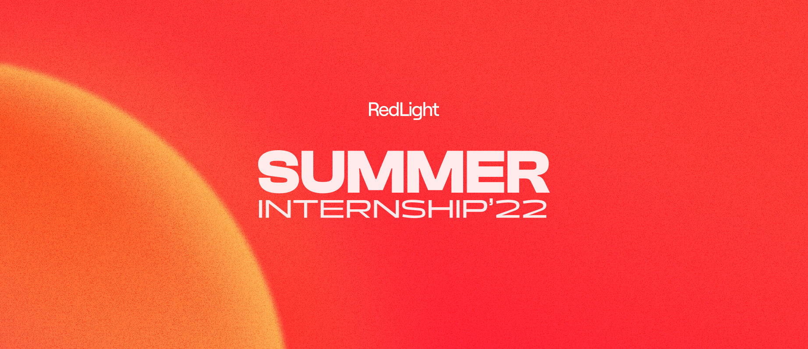

<div id="top"></div>

<!-- PROJECT LOGO -->
<br />
<div align="center">
  <a href="https://github.com/manelfideles/moelas-stock-management">
    
  </a>

<h3 align="center">RedLight Summer Internship 2022 - Dev Challenge</h3>

  <p align="center">
    Stock Management Platform for "O MOELAS".
    <br />
  </p>
</div>

<br />

<!-- TABLE OF CONTENTS -->
<details>
  <summary>Table of Contents</summary>
  <ol>
    <li>
      <a href="#about-the-project">About The Project</a>
      <ul>
        <li><a href="#built-with">Built With</a></li>
      </ul>
    </li>
    <li>
      <a href="#getting-started">Getting Started</a>
      <ul>
        <li><a href="#prerequisites">Prerequisites</a></li>
        <li><a href="#installation">Installation</a></li>
      </ul>
    </li>
    <li><a href="#roadmap">Features</a></li>
    <li><a href="#contact">Contact</a></li>
  </ol>
</details>

<!-- ABOUT THE PROJECT -->
## About The Project

In this challenge, I was expected to implement a web platform to manage "O MOELAS"'s bar stock 🍷.
"O MOELAS" it's a bar with a cozy atmosphere that has been working with the academic community since 1974. It's known for its extensive list of shots and cocktails with inviting prices.
The aim of this challenge is to build a simple web platform that helps the user manage the bar.

### Built With

* [React.js](https://reactjs.org/)
* [Express.js](https://expressjs.com/)
* [Firestore from Firebase](https://firebase.google.com/products/firestore?gclid=Cj0KCQjwheyUBhD-ARIsAHJNM-PKL41lCqefGfyBSCHP17KnNnftHzygVV71sjHA2ZZnNlMDAEf4eWkaAg2hEALw_wcB&gclsrc=aw.ds)

<!-- GETTING STARTED -->
## Getting Started

To get a local copy up and running follow these simple example steps.

### Prerequisites

This is an example of how to list things you need to use the software and how to install them.
* [Node](https://nodejs.org/en/)
* Express
  ```sh
  npm install express --save
  ```


### Installation

1. Clone the repo
   ```sh
   git clone https://github.com/manelfideles/moelas-stock-management.git
   ```
2. Install NPM packages
   ```sh
   cd api
   npm install
   cd ..
   cd client
   npm install
   ```
3. Start server
   ```sh
   cd api && npm start
   ```
4. Start client app
   ```sh
   cd client && npm start
   ```

<!-- ROADMAP -->
## Features

- [X] List existing drinks/cocktails
- [X] Show an existing drink/cocktail
    - [X] (Extra) Optional image upload for drinks
- [X] Delete an existing drink/cocktail
- [X] Search for drinks/cocktails
- [X] Create new drink/cocktail
- [X] Update existing drink/cocktail
- [X] Sell cocktails
    - [X] (Extra) A cocktail cannot be sold if any of if its drinks run out.

<!-- CONTACT -->
## Contact

Manuel Fideles
Email: manuelfideles77@gmail.com
Linkedin: [https://www.linkedin.com/in/manuel-fideles/](manuel-fideles)

Project Link: [https://github.com/manelfideles/moelas-stock-management](https://github.com/manelfideles/moelas-stock-management)

<p align="right">(<a href="#top">back to top</a>)</p>


<!-- MARKDOWN LINKS & IMAGES -->
[linkedin-shield]: https://img.shields.io/badge/-LinkedIn-black.svg?style=for-the-badge&logo=linkedin&colorB=555
[linkedin-url]: https://linkedin.com/in/manuel-fideles